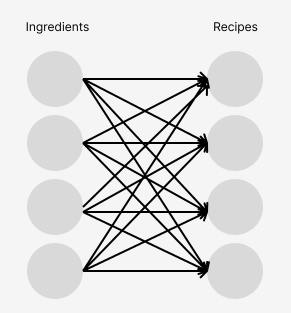

[Home](index.md) | [Projects](projects.md) | [Posts](posts.md)

# Grocery App

[Frontend Code](https://github.com/rochelleli165/grocery-app-frontend)

[Backend Code](https://github.com/rochelleli165/grocery-app-backend)

## Problem
I enjoy cooking, but I'm not a fan of searching up "Recipes that use peppers" or 
"What to make with fish sauce." I also don't like searching up online flyers for
each individual grocery. I would like a single source of truth where I can view
what's on sale.

## Solution
I am currently making an app that web scrapes grocery flyers and given the ingredients
and recipes, maximizes the number of recipes that can be made. The core function of the
app is currently done: it can web scrape flyers from ALDI, and given recipes from a 
Japanese Recipe blog called Just One Cookbook and a pantry of ingredients, one can find
the number of recipes they can make.

### Optimization
**The current project has no clean solution to amounts/units. For now, we will use an 
arbritrary unit. For example, if a recipe called for 1/4 cup carrots and 2 potatoes we
will simplify this to 1 unit of carrot and 1 unit of potato**

Let $I$ be the set of all ingredients and $J$ be the set of all recipes.

Let $s_i$ be the amount of each ingredient the user possesses (the pantry)

Let $d_j$ be the number of unique ingredients recipe $j$ requires.

Let $M$ be the maximum number of unique ingredinets a recipe requires.

The variables $x_{ij}$ are the amount of each ingredient $i \in I$ a user uses for a recipe $j \in J$. 
The sum of ingredients used must equal the supply. 

The variables $y_j$ are the recipes that the user can make. $y$ is binary.
$$ max \sum_{j \in J}^J y_j$$
$$ x_{ij} \leq 1 \ \forall i \in I, \ j \in J $$
$$ \sum_{j \in J}^J x_{ij} \leq s_i \ \forall i \in I $$
$$ \sum_{i \in I}^I x_{ij} - d_j \leq Md_j(y_j)  - (1-y_j) \ \forall j \in J $$
$$ \sum_{i \in I}^I x_{ij} - d_j \geq -Md_j(1-y_j) \ \forall j \in J $$

The last two constraints may be a bit confusing. These conditional constraints
makes sure that if $y_j = 1$, then $\sum_{i \in I}^I x_{ij} = d_j$. Try plugging 
in $y_j$ to be 1 or 0 to see.

Those familiar with optimization will see that this constructs a simple biparte
graph, with ingredients as one layer and recipes in the other layer.

  

The solver I used is Gurobi. At the time of making, I'm still a student, so I 
have a free academic license to it. I don't have many recipes or ingredients yet
so performance is not an issue to be seen yet.

